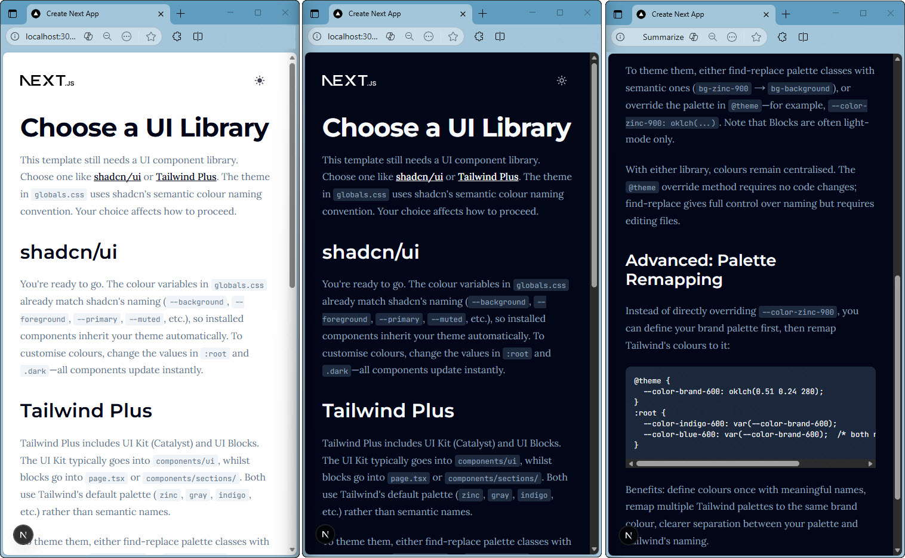

*A Next.js 16 template with modern tooling and CI/CD automation. Code quality checks (linting, formatting, type checking, testing) run via Lefthook locally and GitHub Actions on PRs. Dependency updates automated via Dependabot. Deployments handled by Vercel: Preview for PRs, Production for main. Assumes Claude Code.*

<div align="center">
  <a href="x_docs/images/app_screenshot.jpg" target="_blank">
    
  </a>
  <p><em>Template homepage with theming setup — UI component library still needed</em></p>
</div>

---

## 🎯 Use This Template

(1) Follow [x_docs/project-setup.md](x_docs/project-setup.md) to clone, set up GitHub, set up Vercel.

(2) Choose a UI component approach that supports Tailwind 4, for example:

- [shadcn/ui](https://ui.shadcn.com/) (free). Safe choice, LLM friendly, visually common (style!)
- [Tailwind Plus](https://tailwindcss.com/plus) (paid). Tailwind-made UI components ([Catalyst](https://tailwindcss.com/plus/ui-kit)), ready to use [UI blocks](https://tailwindcss.com/plus/ui-blocks) (think assembled components), and full site [templates](https://tailwindcss.com/plus/templates) but limited.
- [HeroUI v3](https://heroui.com/) (free, paid coming). Very LLM friendly. An installed component library. A solid shadcn alternative for visual identity and richer defaults.

(3) Replace page.tsx, layout.tsx, counter.tsx, button.tsx, theme-toggle.tsx (use an icon), globals.css, fonts.ts

## What's Installed?

For exact list see [package.json](package.json)

| Category | Tool | What it does |
| :------- | :--- | :----------- |
| Framework | [Next.js 16.2.1](https://nextjs.org) | Core webapp foundation — routing, rendering, API routes, optimisation, and builds |
| Language | [TypeScript 5](https://www.typescriptlang.org) | Static type checking with strict mode enabled |
| Styling | [Tailwind CSS v4](https://tailwindcss.com) | Utility-first CSS framework for rapid styling |
| | [next-themes](https://github.com/pacocoursey/next-themes) | Light/dark mode theming provider |
| Linting | [Biome](https://biomejs.dev) | Fast linter and formatter (replaces ESLint + Prettier) |
| | [markdownlint-cli2](https://github.com/DavidAnson/markdownlint-cli2) | Lints markdown files for consistent formatting |
| Testing | [Vitest](https://vitest.dev) | Fast unit test runner (Vite-native, Jest-compatible) |
| | [Playwright](https://playwright.dev) | E2E browser testing (Chromium, Firefox, WebKit, Mobile) |
| | [Testing Library](https://testing-library.com) | React component testing utilities |
| Git Hooks | [Lefthook](https://lefthook.dev) | Runs checks on commit (lint, typecheck, unit tests) and push (build, E2E tests) |
| Optimisation | [React Compiler](https://react.dev/learn/react-compiler) | Automatic memoisation and performance optimisations |
| Analytics | [Vercel Speed Insights](https://vercel.com/docs/speed-insights) | Real user performance metrics viewable on Vercel |
| | [Vercel Web Analytics](https://vercel.com/docs/analytics) | Privacy-friendly visitor analytics viewable on Vercel |


## 📦 Next.js Installation Explained

This template was initialised with the following options and then updated:

```bash
# Next.js installer
$ npx create-next-app@latest

Would you like to use TypeScript?      ✔️ Yes
Which linter would you like to use?    ✔️ Biome
Would you like to use React Compiler?  ✔️ Yes
Would you like to use Tailwind CSS?    ✔️ Yes
Would you like your code inside a src/ directory?  ❌ No
Would you like to use App Router? (recommended)    ✔️ Yes
Would you like to customise the import alias (@/* by default)? ❌ No

# Update all dependencies to latest versions
npm outdated                # Check outdated packages (2025-11-20)
npx npm-check-updates -u    # Rewrite package.json with latest
npm install                 # Install updated versions
```

## ⚙️ Config Files Explained

| File | What | Generally In This Project Template |
| :----- | :----- | :------------------ |
| ▢ [.gitattributes](.gitattributes) | Git line ending and file type handling | Normalises line endings across platforms for consistent Git diffs |
| ▢ [.gitignore](.gitignore) | Files and directories Git should ignore | Prevents build outputs and dependencies from being committed |
| ▢ [.markdownlint.yaml](.markdownlint.yaml) | Markdownlint configuration | Disables strict linting rules for practical writing |
| ▢ [.vscode/extensions.json](.vscode/extensions.json) | VS Code extension recommendations | Useful extensions to use in this Next.js project |
| ▢ [.vscode/settings.json](.vscode/settings.json) | VS Code editor and formatting settings | Enables auto-formatting and configures Biome and Tailwind extensions |
| 🌺 [.claude/commands/](.claude/commands) | Claude Code repeatable prompts | Write commits, evaluate CodeRabbit comments etc. |
| 🌺 [.claude/rules/](.claude/rules) | Claude Code context-aware rules | Auto-injected when editing matching file paths |
| 🌺 [.claude/settings.json](.claude/settings.json) | Claude Code permissions | Allow/Deny permissions for files, commands, websearch etc |
| 🌺 [.mcp.json](.mcp.json) | Claude Code MCP config | e.g. Playwright MCP so Claude Code can "see" app and adjust |
| 🌺 [.claude/CLAUDE.md](.claude/CLAUDE.md) | Claude Code project context | Documents tech stack for Claude Code (customise!) |
| 🅽 [next.config.ts](next.config.ts) | Next.js framework configuration | Enables React Compiler and customises Next.js build settings |
| 🅽 [package.json](package.json) | Project dependencies and npm scripts | Defines project dependencies, scripts, and npm package metadata |
| 🅽 [postcss.config.mjs](postcss.config.mjs) | PostCSS plugins config for CSS processing | Enables Tailwind CSS v4 processing via PostCSS plugin |
| 🧪 [biome.json](biome.json) | Biome linter and formatter | Sets linting rules, formatting style, and import organisation |
| 🧪 [lefthook.yml](lefthook.yml) | Git hooks manager | Automates code quality checks on commit and build + E2E tests on push |
| 🧪 [tsconfig.json](tsconfig.json) | TypeScript compiler settings | Configures TypeScript compiler options and module resolution behaviour |
| 🧪 [playwright.config.ts](playwright.config.ts) | Playwright E2E test runner configuration | Sets test browsers (desktop + mobile), parallel execution, and base URLs |
| 🧪 [.playwright/](.playwright/) | Playwright test outputs (custom organisation) | Contains test artifacts in `test-results/` and HTML `playwright-report/` (all Playwright outputs nested under `/.playwright/` for clean structure) |
| 🧪 [vitest.config.ts](vitest.config.ts) | Vitest test runner config | Sets up React component testing environment and references [vitest.setup.ts](vitest.setup.ts) |
| 🧪 [vitest.setup.ts](vitest.setup.ts) | Global test setup | Adds helpful test assertions like `expect(element).toBeVisible()` |
| 🚀 [.github/dependabot.yml](.github/dependabot.yml) | Dependabot config | Automated dependency update PRs weekly (npm + GitHub Actions) |
| 🚀 [.github/workflows/check-lint-type.yml](.github/workflows/check-lint-type.yml) | GitHub Actions CI workflow | Runs Biome linting/formatting checks and TypeScript type checking on PRs |
| 🚀 [.github/workflows/test-e2e.yml](.github/workflows/test-e2e.yml) | GitHub Actions CI workflow | Runs Playwright E2E tests on PRs (builds production, tests browsers, uploads reports) |
| 🚀 [.github/workflows/test-e2e-vercel.yml](.github/workflows/test-e2e-vercel.yml) | GitHub Actions CI workflow | Runs Playwright E2E tests against Vercel Preview deployments (triggered by Vercel) |
| 🚀 [.github/workflows/test-unit.yml](.github/workflows/test-unit.yml) | GitHub Actions CI workflow | Runs Vitest unit tests on PRs (uses jsdom environment, React Testing Library) |

---

## 🔄 CI/CD Workflow Explained

This diagram shows how CI automation integrates into a typical development workflow:

```text
┌─────────────────────────────────────────────────────────────────────────────┐
│ 💻 LAPTOP: Create a new branch (tests on local dev machine)
└─────────────────────────────────────────────────────────────────────────────┘

  git checkout -b feature/add-dark-mode
  │
  ├─ Commit 1: Add light/dark mode          ⚡ pre-commit hook runs (3s)
  │  ├─ 🎨 Biome lint and format                ✅ Auto-fixed & staged
  │  ├─ 🔍 TypeScript type check                ✅ Pass
  │  └─ 🧪 Vitest unit tests                    ✅ Pass
  │                                               (then committed on all pass)
  │
  ├─ Commit 2: (some more work here)        ⚡ pre-commit hook runs again
  │
  └─ Commit 3: (some more work here)        ⚡ pre-commit hook runs again

  git push origin feature/add-dark-mode     ⚡ pre-PUSH hook runs (~20s)
     ├─ 🏗️  Next.js production build             ✅ Pass
     └─ 🎭 Playwright E2E tests                 ✅ Pass (then pushed to GH)

┌─────────────────────────────────────────────────────────────────────────────┐
│ ☁️  GITHUB: Workflows kickoff on GitHub machines when PR is created
└─────────────────────────────────────────────────────────────────────────────┘

  Create Pull Request → GitHub Actions triggered automatically
  │
  ├─ 🤖 Workflow 1: Lint & Type (biome, tsc)
  │  ├─ Checkout code
  │  ├─ Setup Node.js LTS
  │  ├─ Install dependencies (npm ci)
  │  ├─ Run Biome checks                        ✅ Pass
  │  └─ Run TypeScript checks                   ✅ Pass
  │
  ├─ 🤖 Workflow 2: Unit Tests (vitest)
  │  ├─ Checkout code
  │  ├─ Setup Node.js LTS
  │  ├─ Install dependencies (npm ci)
  │  └─ Run Vitest tests                        ✅ Pass
  │
  └─ 🤖 Workflow 3: E2E Tests (playwright)
     ├─ Checkout code
     ├─ Setup Node.js LTS
     ├─ Install dependencies (npm ci)
     ├─ Install Playwright browsers
     ├─ Build Next.js production
     └─ Run Playwright tests                    ✅ Pass

  ── Meanwhile, Vercel deploys Preview ──────────────────────────

  🚀 Vercel: Preview deployment ready
     └─ Sends repository_dispatch event to GitHub

  └─ 🤖 Workflow 4: E2E Tests on Vercel Preview
     ├─ Triggered by Vercel (not PR event)
     ├─ Runs Playwright against live Preview URL
     └─ Tests real Vercel deployment             ✅ Pass

  GITHUB PR Status: ✅ All checks passed

  🐰 CodeRabbit AI Review Complete
  └─ 3 nitpick comments posted:
     ├─ "Consider using const instead of let" (Button.tsx:12)
     ├─ "Add JSDoc comment" (ThemeContext.tsx:8)
     └─ "Extract magic string to constant" (utils.ts:45)

┌─────────────────────────────────────────────────────────────────────────────┐
│ 💻 Back to Laptop (Addressing 1 out of 3 nitpick comments on open PR)
└─────────────────────────────────────────────────────────────────────────────┘

  ├─ Commit 4: Use const instead of let     ⚡ pre-commit hook runs

  git push origin feature/add-dark-mode     ⚡ pre-push hook runs (~20s)
     ├─ 🏗️  Next.js production build             ✅ Pass
     └─ 🎭 Playwright E2E tests                 ✅ Pass (then pushed to GH)

┌─────────────────────────────────────────────────────────────────────────────┐
│ ☁️  GITHUB (Workflows kick off again on any PR changes)
└─────────────────────────────────────────────────────────────────────────────┘

  New commits pushed → GitHub Actions re-run automatically
  │
  ├─ 🤖 Lint & Type                             ✅ Pass
  ├─ 🤖 Unit Tests                              ✅ Pass
  └─ 🤖 E2E Tests                               ✅ Pass

  PR Status: ✅ All checks passed (1 new commit)
  🐰 CodeRabbit: "Looks good! 1 issue resolved."

  Okay I'm ready! [Merge Pull Request] ← Click! 🎉

  ┌─────────────────────────────────────────────┐
  │ Branch Protection Verified:                 │
  │ ✅ All status checks passed                │
  │ ✅ Branch is up to date with main          │
  └─────────────────────────────────────────────┘

  main branch updated (merge commit preserves 4 commits)
  └─ 🚀 Vercel deployment triggered → Production
```

Key CI Takeaways

- Local Hooks — Catch issues before commit or reaching GitHub
- GitHub Actions — Validate every PR with fresh environment (reproducible CI)
- Branch Protection — Prevents merging broken code (all checks must pass)
- Fast Feedback — Pre-commit catches 90% of issues locally in ~3s vs ~2min CI wait
- Quality Gates — Code is validated 2× (local + CI) before reaching production


## 📝 Quick Notes

(1) Use Ngrok to Test App From Phone

```markdown
1. Sign up and follow https://dashboard.ngrok.com/get-started/setup/linux
2. Then: (Terminal 1: `npm run dev`) + (Terminal 2: `ngrok http 3000`)
3. Ngrok gives a URL to connect from phone (shareable)
```

(2) How Vitest Pieces Work Together

```markdown
1. When you run npm test, Vitest loads vitest.config.ts
2. The config tells Vitest to use jsdom and load `vitest.setup.ts`
3. Your test files can use global test functions and extended matchers
4. The @/* import alias works in tests thanks to `vite-tsconfig-paths`
5. React components are compiled with React Compiler (matching prod)
```

(3) GitHub - A branch protection ruleset to be setup to protect main. Incldues checks for GitHub workflow jobs to pass before merging PR to main. See [x_docs/project-setup.md](x_docs/project-setup.md).

(4) Vercel For Deploys - When you raise a PR it automatically deploys to Vercel Preview and Playwright e2e tests run on that too in addition to GitHub servers. When you merge the PR into main, you are deploying to Vercel prod. See [x_docs/project-setup.md](x_docs/project-setup.md).

## Common Additions for New Projects

When starting a new project from this template, you'll typically add:

- UI components (shadcn/ui, Radix, Tailwind UI kit, or Headless UI)
- State management (Zustand, Jotai, or React Context)
- Data fetching (React Query, SWR, or native fetch with Server Components)
- Forms (React Hook Form, Zod for validation)
- Authentication (NextAuth.js, Clerk, or Supabase Auth)
- Database/ORM (Neon or Supabase with Prisma or Drizzle. Or try Convex!)
