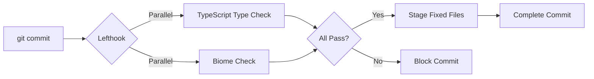

# Next.js 16 Pre-Commit Hook Setup Guide

## Stack Overview

This guide establishes a modern, high-performance pre-commit workflow for Next.js 16 with TypeScript, optimised for speed and developer experience in 2025.

### Selected Tools

| Tool | Purpose | Why |
|------|---------|-----|
| **Lefthook** | Git hook manager | Fast (Go-based), cross-platform, zero runtime dependencies, parallel execution |
| **Biome** | Linting & formatting | Already installed, unified toolchain, 35x faster than ESLint, native TypeScript support |
| **TypeScript** | Type checking | Built-in compiler with `noEmit` for type validation without file generation |
| **Turbopack** | Bundling | Default in Next.js 16, Rust-based incremental bundler with lazy compilation |

### Why This Stack?

**Performance-First Architecture**

- Lefthook executes hooks through native binary with caching and parallel execution
- Biome replaces ESLint + Prettier with single Rust-based tool (10-100x faster)
- TypeScript type checking runs in parallel with linting, not sequentially

**Modern Best Practices (2025)**

- Lefthook gaining adoption over Husky for polyglot projects and performance
- Operates only on staged files to minimise pre-commit time
- Zero configuration for Turbopack (automatic TypeScript, JSX, CSS support)
- VCS integration in Biome respects `.gitignore` automatically

**Developer Experience**

- Single YAML configuration file (`lefthook.yml`)
- Automatic staging of auto-fixed files
- Clear error messages with actionable fixes from Biome
- No manual intervention required for hook conflicts

---

## Technical Architecture

### Pre-Commit Workflow



### Command Execution Strategy

**Parallel Tasks (Independent)**

1. **TypeScript Type Check**: `tsc --noEmit` runs on entire project (type checking requires full project context)
2. **Biome Check**: Runs on staged files only for formatting, linting, and import organisation

**Sequential Steps (Dependent)**

1. Run checks
2. Apply safe fixes with `--write`
3. Stage modified files with `stage_fixed: true`

---

## Detailed Setup Process

### 1. Install Lefthook

**Installation**

```bash
npm install --save-dev lefthook
```

**Initialise Git Hooks**

```bash
npx lefthook install
```

This creates `.git/hooks` directory and configures Git to use Lefthook.

### 2. Configure Lefthook

Create `lefthook.yml` in project root:

```yaml
# lefthook.yml
pre-commit:
  parallel: true
  commands:
    # TypeScript type checking (full project - types need complete context)
    type-check:
      run: npx tsc --noEmit

    # Biome: format, lint, organise imports, apply safe fixes
    biome-check:
      glob: "*.{js,ts,cjs,mjs,jsx,tsx,json,jsonc}"
      run: npx @biomejs/biome check --write --no-errors-on-unmatched --files-ignore-unknown=true {staged_files}
      stage_fixed: true
```

**Configuration Explanation**

| Option | Purpose |
|--------|---------|
| `parallel: true` | Run TypeScript and Biome simultaneously for speed |
| `glob` | File pattern matching (Biome handles these extensions) |
| `run` | Command to execute with `{staged_files}` placeholder |
| `stage_fixed: true` | Automatically stage files modified by Biome |
| `--write` | Apply safe fixes automatically |
| `--no-errors-on-unmatched` | Silent when no files match (e.g., committing only images) |
| `--files-ignore-unknown=true` | Skip files Biome doesn't support |

### 3. Update Package Scripts

Add convenience scripts to `package.json`:

```json
{
  "scripts": {
    "dev": "next dev",
    "build": "next build",
    "start": "next start",
    "lint": "biome check",
    "lint:fix": "biome check --write",
    "format": "biome format --write",
    "type-check": "tsc --noEmit",
    "prepare": "lefthook install"
  }
}
```

**Key Script: `prepare`**

- Automatically runs after `npm install`
- Ensures Lefthook hooks are installed when team members clone repository
- Critical for team consistency

### 4. Verify Configuration

**Test TypeScript Type Checking**

```bash
npm run type-check
```

**Test Biome Linting**

```bash
npm run lint
```

**Test Pre-Commit Hook**

```bash
# Make a change to any file
echo "// test" >> src/app/page.tsx

# Stage the file
git add src/app/page.tsx

# Attempt commit (hooks will run)
git commit -m "test: verify pre-commit hooks"
```

Expected behaviour:

1. TypeScript checks entire project for type errors
2. Biome formats and lints staged file
3. If Biome fixes anything, file is automatically re-staged
4. Commit proceeds only if all checks pass

---

## Configuration Deep Dive

### TypeScript Configuration

Current `tsconfig.json` is already optimal:

```json
{
  "compilerOptions": {
    "noEmit": true,        // Don't generate .js files (Turbopack handles builds)
    "skipLibCheck": true,  // Skip type checking .d.ts files (faster)
    "strict": true         // Enable all strict type checking options
  }
}
```

**Key Options for Pre-Commit**

- **`noEmit: true`**: Type check without file generation (perfect for pre-commit)
- **`skipLibCheck: true`**: Skip `node_modules` type checking (significant speed improvement)
- **`strict: true`**: Comprehensive type safety (catches bugs early)

### Biome Configuration

Current `biome.json` is well-configured:

```json
{
  "vcs": {
    "enabled": true,
    "clientKind": "git",
    "useIgnoreFile": true  // Respects .gitignore
  },
  "formatter": {
    "enabled": true,
    "indentStyle": "space",
    "indentWidth": 2
  },
  "linter": {
    "enabled": true,
    "rules": {
      "recommended": true
    },
    "domains": {
      "next": "recommended",    // Next.js-specific rules
      "react": "recommended"    // React best practices
    }
  },
  "assist": {
    "actions": {
      "source": {
        "organizeImports": "on"  // Auto-sort imports
      }
    }
  }
}
```

**Biome Advantages**

- VCS integration respects `.gitignore` automatically
- Next.js and React domain-specific rules enabled
- Import organisation runs automatically
- Single tool replaces ESLint + Prettier (fewer dependencies)

---

## Future Extensions

### Adding Jest Tests

When ready to add Jest:

```yaml
# lefthook.yml
pre-commit:
  parallel: true
  commands:
    type-check:
      run: npx tsc --noEmit

    biome-check:
      glob: "*.{js,ts,cjs,mjs,jsx,tsx,json,jsonc}"
      run: npx @biomejs/biome check --write --no-errors-on-unmatched --files-ignore-unknown=true {staged_files}
      stage_fixed: true

    # Run Jest on changed test files
    jest:
      glob: "*.{test,spec}.{js,ts,tsx}"
      run: npx jest --bail --findRelatedTests {staged_files}
```

**Jest Options**

- `--bail`: Stop on first test failure (faster feedback)
- `--findRelatedTests`: Only run tests related to changed files

### Adding Playwright E2E Tests

For pre-push hook (E2E tests are slower, not suitable for pre-commit):

```yaml
# lefthook.yml
pre-push:
  commands:
    playwright:
      run: npx playwright test
```

**Why Pre-Push?**

- E2E tests are slower (network requests, browser automation)
- Pre-commit should be <5 seconds
- Pre-push allows longer-running integration tests

---

## Performance Considerations

### Why Lefthook Over Husky?

| Feature | Lefthook | Husky |
|---------|----------|-------|
| **Language** | Go (native binary) | JavaScript (Node.js) |
| **Execution** | Parallel by default | Sequential (bash) |
| **Dependencies** | Zero runtime deps | Requires Node.js |
| **Configuration** | YAML (declarative) | Shell scripts (imperative) |
| **Caching** | Built-in binary caching | None |
| **Speed** | ~2-3x faster | Baseline |

### Optimisation Strategies

**1. Staged Files Only**

```yaml
run: command {staged_files}  # Only process staged files
```

Benefits: 10-100x faster than checking entire codebase

**2. Parallel Execution**

```yaml
parallel: true
```

Benefits: Type checking and linting run simultaneously

**3. TypeScript Optimisations**

- `skipLibCheck: true` in `tsconfig.json`
- Reduces type checking time by 30-50%

**4. Biome Over ESLint + Prettier**

- Single tool vs. two tools (fewer processes)
- Rust-based vs. JavaScript (native performance)
- 10-100x faster depending on codebase size

### Expected Pre-Commit Times

| Codebase Size | Expected Time |
|--------------|---------------|
| Small (< 50 files) | 1-2 seconds |
| Medium (50-200 files) | 2-4 seconds |
| Large (200-1000 files) | 4-8 seconds |

Times assume modern hardware (SSD, 8+ cores). Type checking dominates execution time.

---

## Team Onboarding

### First-Time Setup

**1. Clone Repository**

```bash
git clone <repository-url>
cd my-app
```

**2. Install Dependencies**

```bash
npm install
```

This automatically runs `prepare` script, installing Lefthook hooks.

**3. Verify Setup**

```bash
npx lefthook run pre-commit
```

Should output hook configuration and run checks on staged files.

### Troubleshooting

**Hook Not Running**

```bash
# Reinstall hooks
npx lefthook install
```

**Slow Type Checking**

- Ensure `skipLibCheck: true` in `tsconfig.json`
- Check for circular dependencies
- Consider incremental compilation in CI (not pre-commit)

**Biome Conflicts**

```bash
# Run Biome manually to see detailed errors
npm run lint:fix
```

---

## Best Practices

### Commit Message Hygiene

Consider adding Commitlint in future:

```yaml
# lefthook.yml
commit-msg:
  commands:
    lint:
      run: npx commitlint --edit {1}
```

Ensures conventional commit messages: `feat:`, `fix:`, `docs:`, etc.

### Editor Integration

**VS Code** (Recommended)

```bash
# Install Biome extension
code --install-extension biomejs.biome
```

Configure `.vscode/settings.json`:

```json
{
  "editor.defaultFormatter": "biomejs.biome",
  "editor.formatOnSave": true,
  "editor.codeActionsOnSave": {
    "quickfix.biome": "explicit",
    "source.organizeImports.biome": "explicit"
  }
}
```

Benefits: Format and lint on save, reducing pre-commit fixes

### CI/CD Integration

**GitHub Actions Example**

```yaml
name: CI

on: [push, pull_request]

jobs:
  lint:
    runs-on: ubuntu-latest
    steps:
      - uses: actions/checkout@v4
      - uses: actions/setup-node@v4
        with:
          node-version: 20
      - run: npm ci
      - run: npm run type-check
      - run: npm run lint
      - run: npm run build
```

Use `biome ci` instead of `biome check` in CI (optimised for CI environments, outputs GitHub annotations).

---

## Summary

### What We Achieved

1. **Fast Pre-Commit Checks**: Parallel execution of type checking and linting on staged files only
2. **Modern Toolchain**: Lefthook + Biome + TypeScript = minimal dependencies, maximum performance
3. **Developer Experience**: Automatic fixes, clear errors, no manual intervention
4. **Team Consistency**: `prepare` script ensures all team members have hooks installed
5. **Extensibility**: Easy to add Jest, Playwright, Commitlint as project matures

### Key Files

- `lefthook.yml` - Git hook configuration
- `biome.json` - Linting and formatting rules
- `tsconfig.json` - TypeScript compiler options
- `package.json` - Scripts for manual checks

### Next Steps

1. **Install Lefthook**: `npm install --save-dev lefthook`
2. **Create Configuration**: Copy `lefthook.yml` to project root
3. **Update Scripts**: Add `prepare` script to `package.json`
4. **Test Setup**: Make a commit and verify hooks run
5. **Team Rollout**: Document in project README, share with team

### Resources

- [Lefthook Documentation](https://lefthook.dev)
- [Biome Documentation](https://biomejs.dev)
- [Biome Git Hooks Guide](https://biomejs.dev/recipes/git-hooks/)
- [TypeScript Compiler Options](https://www.typescriptlang.org/tsconfig)
- [Next.js 16 Documentation](https://nextjs.org/docs)

---

*Generated for Next.js 16.0.1 with TypeScript 5 and Biome 2.2.0 - January 2025*
